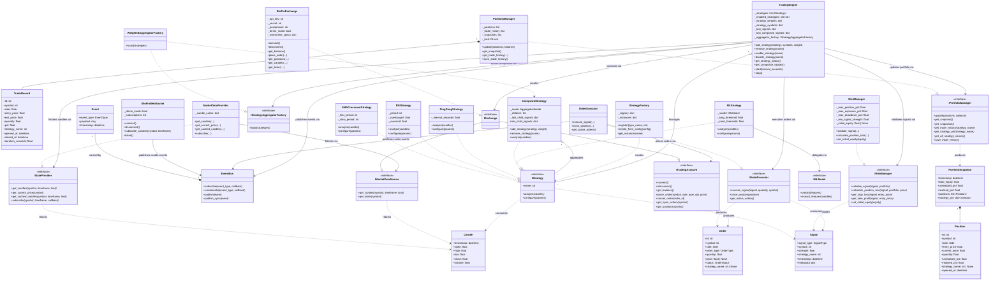

# Trade Agent 2 — UML Class Diagram

```mermaid
classDiagram
    %% ─── CORE MODELS ────────────────────────────────────────────────────────
    class Candle {
        +timestamp: datetime
        +open: float
        +high: float
        +low: float
        +close: float
        +volume: float
    }
    class Signal {
        +signal_type: SignalType
        +symbol: str
        +strength: float
        +strategy_name: str
        +timestamp: datetime
        +metadata: dict
    }
    class Order {
        +id: str
        +symbol: str
        +side: Side
        +order_type: OrderType
        +quantity: float
        +price: float | None
        +status: OrderStatus
        +strategy_name: str | None
    }
    class Position {
        +id: str
        +symbol: str
        +side: Side
        +entry_price: float
        +current_price: float
        +quantity: float
        +unrealized_pnl: float
        +realized_pnl: float
        +strategy_name: str | None
        +opened_at: datetime
    }
    class TradeRecord {
        +id: str
        +symbol: str
        +side: Side
        +entry_price: float
        +exit_price: float
        +quantity: float
        +pnl: float
        +strategy_name: str
        +opened_at: datetime
        +closed_at: datetime
        +duration_seconds: float
    }
    class PortfolioSnapshot {
        +timestamp: datetime
        +total_equity: float
        +unrealized_pnl: float
        +realized_pnl: float
        +positions: list~Position~
        +strategy_pnl: dict~str‚float~
    }
    class Event {
        +event_type: EventType
        +payload: Any
        +timestamp: datetime
    }
    class EventBus {
        +subscribe(event_type, callback)
        +unsubscribe(event_type, callback)
        +publish(event)
        +publish_sync(event)
    }

    PortfolioSnapshot "1" *-- "*" Position
    Event "1" --* "1" EventBus : carried by

    %% ─── EXCHANGE ───────────────────────────────────────────────────────────
    class IMarketDataSource {
        <<interface>>
        +get_candles(symbol, timeframe, limit)*
        +get_ticker(symbol)*
    }
    class ITradingAccount {
        <<interface>>
        +connect()*
        +disconnect()*
        +get_balance()*
        +place_order(symbol, side, type, qty, price)*
        +cancel_order(order_id)*
        +get_open_orders(symbol)*
        +get_positions(symbol)*
    }
    class IExchange {
        <<interface>>
    }
    class BloFinExchange {
        -_api_key: str
        -_secret: str
        -_passphrase: str
        -_demo_mode: bool
        -_instrument_specs: dict
        +connect()
        +disconnect()
        +get_balance()
        +place_order(...)
        +get_positions(...)
        +get_candles(...)
        +get_ticker(...)
    }
    class BloFinWebSocket {
        -_demo_mode: bool
        -_subscriptions: list
        +connect()
        +disconnect()
        +subscribe_candles(symbol, timeframe)
        +listen()
    }

    IExchange --|> IMarketDataSource
    IExchange --|> ITradingAccount
    BloFinExchange ..|> IExchange
    BloFinWebSocket --> EventBus : publishes candle events

    %% ─── DATA ───────────────────────────────────────────────────────────────
    class IDataProvider {
        <<interface>>
        +get_candles(symbol, timeframe, limit)*
        +get_current_price(symbol)*
        +get_cached_candles(symbol, timeframe, limit)*
        +subscribe(symbol, timeframe, callback)*
    }
    class MarketDataProvider {
        -_candle_cache: dict
        +get_candles(...)
        +get_current_price(...)
        +get_cached_candles(...)
        +subscribe(...)
    }

    MarketDataProvider ..|> IDataProvider
    MarketDataProvider --> IMarketDataSource : fetches via
    IDataProvider ..> Candle : returns
    IMarketDataSource ..> Candle : returns

    %% ─── STRATEGIES ─────────────────────────────────────────────────────────
    class IStrategy {
        <<interface>>
        +name: str
        +analyze(candles)*
        +configure(params)*
    }
    class IStrategyAggregatorFactory {
        <<interface>>
        +build(strategies)*
    }
    class SMACrossoverStrategy {
        -_fast_period: int
        -_slow_period: int
        +analyze(candles)
        +configure(params)
    }
    class RSIStrategy {
        -_period: int
        -_overbought: float
        -_oversold: float
        +analyze(candles)
        +configure(params)
    }
    class PingPongStrategy {
        -_interval_seconds: float
        +analyze(candles)
        +configure(params)
    }
    class MLStrategy {
        -_model: IMLModel
        -_long_threshold: float
        -_short_threshold: float
        +analyze(candles)
        +configure(params)
    }
    class IMLModel {
        <<interface>>
        +predict(features)*
        +extract_features(candles)*
    }
    class CompositeStrategy {
        -_mode: AggregationMode
        -_children: list
        -_last_child_signals: dict
        +add_strategy(strategy, weight)
        +remove_strategy(name)
        +analyze(candles)
        +last_child_signals: dict
    }
    class WeightedAggregatorFactory {
        +build(strategies)
    }
    class StrategyFactory {
        -_registry: dict
        -_instances: dict
        +register(type_name, cls)
        +create_from_config(config)
        +get_instance(name)
    }

    SMACrossoverStrategy ..|> IStrategy
    RSIStrategy ..|> IStrategy
    PingPongStrategy ..|> IStrategy
    MLStrategy ..|> IStrategy
    CompositeStrategy ..|> IStrategy
    CompositeStrategy "1" o-- "*" IStrategy : aggregates
    MLStrategy --> IMLModel : delegates to
    WeightedAggregatorFactory ..|> IStrategyAggregatorFactory
    WeightedAggregatorFactory ..> CompositeStrategy : creates
    StrategyFactory ..> IStrategy : creates
    IStrategy ..> Candle : consumes
    IStrategy ..> Signal : produces

    %% ─── RISK ───────────────────────────────────────────────────────────────
    class IRiskManager {
        <<interface>>
        +validate_signal(signal, portfolio)*
        +calculate_position_size(signal, portfolio, price)*
        +get_stop_loss(signal, entry_price)*
        +get_take_profit(signal, entry_price)*
        +set_initial_equity(equity)*
    }
    class RiskManager {
        -_max_position_pct: float
        -_max_exposure_pct: float
        -_max_drawdown_pct: float
        -_min_signal_strength: float
        -_initial_equity: float | None
        +validate_signal(...)
        +calculate_position_size(...)
        +set_initial_equity(equity)
    }

    RiskManager ..|> IRiskManager
    IRiskManager ..> Signal : validates

    %% ─── EXECUTION ──────────────────────────────────────────────────────────
    class IOrderExecutor {
        <<interface>>
        +execute_signal(signal, quantity, symbol)*
        +close_position(position)*
        +get_active_orders()*
    }
    class OrderExecutor {
        +execute_signal(...)
        +close_position(...)
        +get_active_orders()
    }

    OrderExecutor ..|> IOrderExecutor
    OrderExecutor --> ITradingAccount : places orders via
    OrderExecutor --> EventBus : publishes order events
    IOrderExecutor ..> Signal : consumes
    IOrderExecutor ..> Order : produces
    ITradingAccount ..> Order : produces

    %% ─── PORTFOLIO ──────────────────────────────────────────────────────────
    class IPortfolioManager {
        <<interface>>
        +update(positions, balance)*
        +get_snapshot()*
        +get_snapshots()*
        +get_trade_history(strategy_name)*
        +get_strategy_pnl(strategy_name)*
        +get_all_strategy_names()*
        +save_trade_history()*
    }
    class PortfolioManager {
        -_positions: list
        -_trade_history: list
        -_snapshots: list
        -_lock: RLock
        +update(positions, balance)
        +get_snapshot()
        +get_trade_history(...)
        +save_trade_history()
    }

    PortfolioManager ..|> IPortfolioManager
    PortfolioManager "1" *-- "*" TradeRecord
    IPortfolioManager ..> PortfolioSnapshot : produces

    %% ─── ENGINE ─────────────────────────────────────────────────────────────
    class TradingEngine {
        -_strategies: list~IStrategy~
        -_enabled_strategies: set~str~
        -_strategy_weights: dict
        -_strategy_symbols: dict
        -_last_signals: dict
        -_last_composite_signals: dict
        -_aggregator_factory: IStrategyAggregatorFactory
        +add_strategy(strategy, symbols, weight)
        +remove_strategy(name)
        +enable_strategy(name)
        +disable_strategy(name)
        +get_strategy_status()
        +get_composite_signals()
        +start(interval_seconds)
        +stop()
    }

    TradingEngine --> IExchange : connects via
    TradingEngine --> IDataProvider : fetches candles via
    TradingEngine --> IRiskManager : validates signals via
    TradingEngine --> IOrderExecutor : executes orders via
    TradingEngine --> IPortfolioManager : updates portfolio via
    TradingEngine --> EventBus : publishes events via
    TradingEngine --> IStrategyAggregatorFactory : builds composites via
    TradingEngine "1" o-- "*" IStrategy : manages
```
